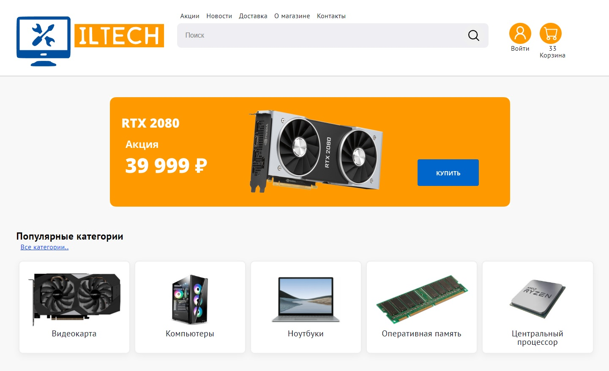

# Computer hardware e-commerce website




## Clone the project

```bash
$ git clone https://github.com/ilia-savage/marketplace-retail-e-commerce
```

## Start the project

You have to install docker and docker-compose
```bash
$ docker-compose up --build -d
```

The frontend server will start up at 127.0.0.1:8080  
The backend will start up at 127.0.0.1:8000

## Stop the project

```bash
$ docker-compose down
```
